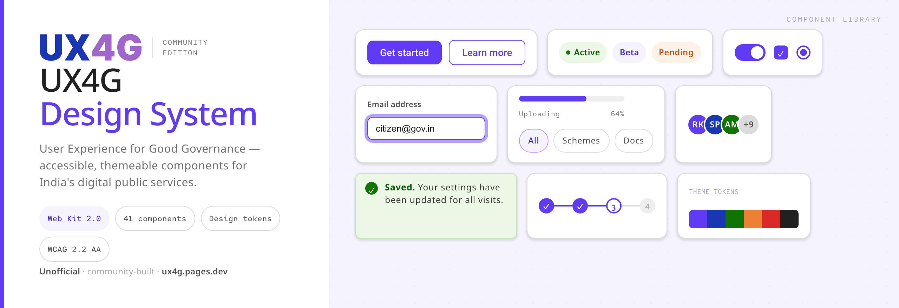

<p align="center">
  <a href="https://ux4g.pages.dev">
    
  </a>
</p>

# UX4G community packaging

[UX4G](https://www.ux4g.gov.in/) is India's official government design system ("User Experience for Good Governance"), but it ships as a Figma kit with no straightforward way to use it in a real React project.

This repo turns it into code: zero-dependency React components and CSS-variable tokens you install from npm, plus a shadcn registry you can copy component by component. 41 components, themeable, built to WCAG 2.2 AA.

Live docs and component gallery: **[ux4g.pages.dev](https://ux4g.pages.dev)**

> Unofficial and community-maintained. UX4G is © NeGD · MeitY, Government of India. This is not an official release.

## Install

```bash
pnpm add @hopline/ux4g-react @hopline/ux4g-tokens
```

```tsx
import "@hopline/ux4g-tokens/styles.css"; // once, at the app root
import { Button } from "@hopline/ux4g-react";

export const Apply = () => <Button variant="primary">Apply now</Button>;
```

- `@hopline/ux4g-react`: 41 React components (React 18+ peer, no other dependencies).
- `@hopline/ux4g-tokens`: the design tokens as one CSS import plus a typed `theme` object.

## Copy the source instead (shadcn)

Prefer to own a component outright, with no dependency? Pull it from the hosted registry:

```bash
npx shadcn add https://ux4g.pages.dev/r/button.json
```

Swap `button` for any component name. From a local checkout: `npx shadcn add ./registry/r/button.json`.

## Develop

```bash
pnpm install
pnpm build      # tokens + react
pnpm test
pnpm --filter playground dev   # live demo
```

Layout: `packages/tokens` and `packages/react` are the published packages, `registry/` is the shadcn registry, `apps/docs` is the site, and `examples/playground` is a Vite demo.

## Roadmap

Web (this repo), then React Native, then Flutter. Each platform reimplements against the same tokens and `contracts/*.d.ts`.

## Credits

Modelled on UX4G (NeGD · MeitY, ux4g.gov.in) and built from the _UX4G Design System 2.0 Web Kit (Community)_ Figma. Icons use Lucide geometry (ISC). MIT licensed.

<div align="center">
  <a href="https://hopline.co">
    
  </a>
</div>
