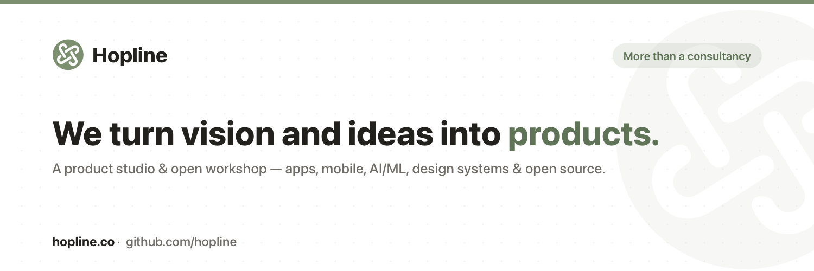

# UX4G — community packaging

An ultra-light, LLM-friendly packaging of **UX4G** (User Experience for Good
Governance), India's government design system. Zero-dependency React components
and CSS-variable design tokens, distributed both as npm packages and as a
shadcn-compatible registry.

> Unofficial community packaging. UX4G is © NeGD · MeitY, Government of India ·
> ux4g.gov.in. This repo is not an official UX4G release.

## Packages
- **`@hopline/ux4g-tokens`** — one CSS import (variables, fonts, interaction
  layer) + a typed `theme` object.
- **`@hopline/ux4g-react`** — 32 zero-dependency React components (React 18+ peer).

## Quickstart
```bash
pnpm add @hopline/ux4g-react @hopline/ux4g-tokens
```
```tsx
import "@hopline/ux4g-tokens/styles.css";
import { Button } from "@hopline/ux4g-react";
```

## Or own the source (shadcn registry)
```bash
npx shadcn add ./registry/r/button.json
```

## Develop
```bash
pnpm install
pnpm build         # tokens + react
pnpm test          # vitest
pnpm registry:build
pnpm --filter playground dev   # live demo
```

## Layout
- `packages/tokens`, `packages/react` — the published packages.
- `registry/` — shadcn registry (built to `registry/r/`).
- `examples/playground` — Vite demo.
- `llms.txt` — machine-readable index for coding agents.

## Roadmap
Web (this repo) → React Native → Flutter. Tokens + the `contracts/*.d.ts` are the
universal layer the native packages reimplement against.

## Credits
Design system: UX4G · NeGD · MeitY (ux4g.gov.in). Built from the
*UX4G Design System 2.0 Web Kit (Community)* Figma. Icons: Lucide geometry (ISC).

---

<div align="center">
  <a href="https://hopline.co">
    
  </a>
  <p><sub>Maintained by <a href="https://hopline.co">hopline.co</a> · Building in the open.</sub></p>
</div>
